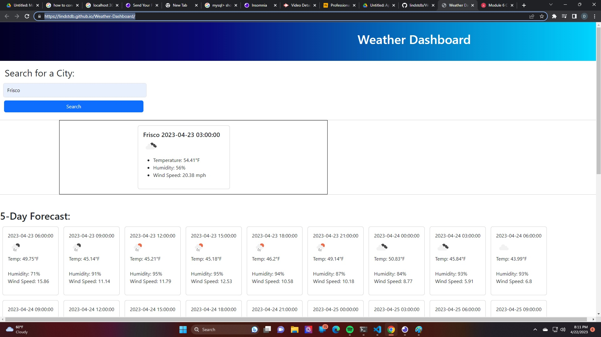

# Weather-Dashboard

## Description

Aweather dashboard that displays a current weathert and five-day forecast for a serached city.

- The motivation for this application was to build a weather station that is easy to use and free.
- I built this application to practice my api skills and find out what its like outside.
- This application solves the problem of not knowing what to wear.
- I learned that specifying an api call can get tricky.

## Screenshot

https://lindstdb.github.io/Weather-Dashboard/

